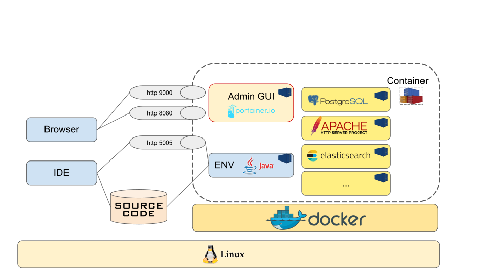

# Description of the development environment

## Schema 




## Prepare environnement 

- Create developpement network in docker. The network name is **devnet**

```
.createNetwork.sh
```

- Set source code directory

  + Rename the file *env_template* in .env
  + Set **sources_directory** variable with your source code directory

## Starting developpement environnement

```
.startENV_RM.sh
.startENV_Liferay.sh
.startENV_WordPress.sh
.startENV_Ionic.sh
```

## Enter in the container


- Set environnemet image

  + For Java
```
source ./setEnv.sh java
```

  + For Ionic
```
source ./setEnv.sh ionic
```

- Entrer 

```
.shell.sh

or 

sudo docker container exec -it docker_dev-app_1 bash
sudo docker container exec -it --user root docker_dev-app_1 bash


```

## Admin

If you want manage your docker environnement with an ihm, you can start **portainer** with the following script

```
./admin.sh
```

Open WebConsole at the address
```
http://localhost:9999
```

## Sonar

Please remove **sonarHTML** plugin from sonarquke backoffice


## if problem,

```
sudo docker ps -a
sudo docker rm ...
```

## In container Java image
- You can use the following command to switch java version
```
sudo update-alternatives --config java
```


### Extract content from a container
```
docker cp <containerId>:/file/path/within/container /host/path/target
```


### Network
```
netstat -an
```


### Ionic

#### Before start ionic application

  1. Configure .env file with env_template , complete **sources_directory** and **android_directory**
  2. Start container **.startENV_Ionic.sh** and go inside container with **setEnv.sh** and **shell.sh** 
  3. Execute **installAndroid.sh** script in **/home/user1/script** (only once)

#### Start application inside the container

```
ionic serve --lab --address=0.0.0.0
```