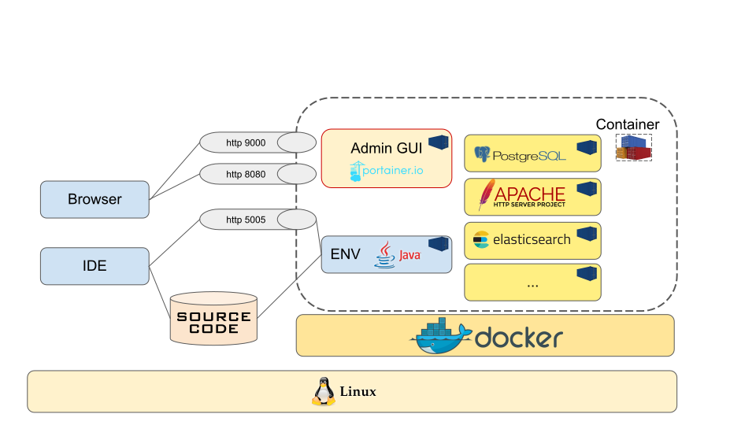

# Docker Dev Station - Environnement de Développement Complet



## 🚀 Aperçu

**Docker Dev Station** est un environnement de développement modulaire et complet qui fournit tous les outils et services nécessaires pour le développement, les tests et le déploiement d'applications modernes. Basé sur Docker, il offre un environnement cohérent et isolé qui peut être facilement géré et personnalisé.

## 📁 Structure du Projet

```
.
├── environnement/          # Cœur de la Docker Dev Station
│   ├── admin/              # Outils d'administration (Portainer)
│   ├── apm/               # Surveillance des performances applicatives
│   ├── db/                # Serveurs de bases de données
│   ├── dxp/               # Plateformes d'expérience digitale
│   ├── iam/               # Gestion des identités et accès
│   ├── language/          # Environnements de langage
│   ├── mail/              # Serveurs de messagerie
│   ├── monitoring/        # Outils de monitoring
│   ├── proxy/             # Serveurs proxy
│   ├── reverse-proxy/     # Reverse proxies
│   ├── saas/              # Outils SaaS
│   ├── scripts/           # Scripts utilitaires
│   ├── sharing/           # Outils de partage de fichiers
│   ├── sonar/             # Qualité de code
│   ├── storage/           # Solutions de stockage
│   ├── tools/             # Outils de développement
│   └── ui/                # Composants d'interface utilisateur
├── resources/            # Schémas d'architecture et documentation
├── sources/              # Projets exemples et code source
└── README_FR.md           # Ce fichier
```

## 🎯 Fonctionnalités Clés

- **Architecture Modulaire** : 23+ services indépendants pouvant être démarrés/arrêtés individuellement
- **Gestion Centralisée** : Interface de commande unifiée via `dcmd.sh`
- **Configurations Prêtes pour la Production** : Configurations Docker optimisées pour chaque service
- **Outils de Développement** : Tout ce dont vous avez besoin, des IDE aux outils de débogage
- **Support de Bases de Données** : Plusieurs bases de données SQL et NoSQL
- **Monitoring & APM** : Surveillance des performances et insights applicatifs
- **Infrastructure Réseau** : Reverse proxies, load balancers et outils réseau

## 🚀 Démarrage Rapide

### Prérequis

- Docker installé et en cours d'exécution
- Docker Compose v3+
- Connaissance basique des concepts Docker

### Configuration

1. **Créer le réseau de développement** :
   ```bash
   ./createNetwork.sh
   ```

2. **Configurer les variables d'environnement** :
   ```bash
   cp env_template .env
   # Modifier .env pour définir vos chemins
   ```

3. **Ajouter des alias pratiques à votre `.bashrc`** :
   ```bash
   echo "alias dds='cd $(pwd)'" >> ~/.bashrc
   echo "alias ecmd='$(pwd)/environnement/ecmd.sh'" >> ~/.bashrc
   source ~/.bashrc
   ```

## 📖 Catégories de Services

### 🔧 Administration & Gestion

- **Portainer** : Interface web de gestion Docker (port 9999)
- **OmniDB** : Interface de gestion de bases de données (port 8000)
- **Scripts centralisés** : `dcmd.sh` pour la gestion unifiée des services

### 🗃️ Serveurs de Bases de Données

| Service | Port | Description |
|---------|------|-------------|
| MariaDB | 3306 | Base de données relationnelle compatible MySQL |
| MySQL | 3306 | Base de données Oracle MySQL |
| PostgreSQL | 5432 | Base de données open-source avancée |
| MongoDB | 27017 | Base de données NoSQL orientée documents |
| Oracle | 1521 | Base de données relationnelle entreprise |

### 🌐 Plateformes d'Expérience Digitale

- **Liferay DXP** : Plateforme de portails d'entreprise (port 18080)
- **Drupal** : CMS basé sur PHP
- **Strapi** : CMS headless avec APIs REST/GraphQL

### 🔐 Gestion des Identités et Accès

- **Keycloak** : Gestion des identités et accès open-source (port 9080)
- **LDAP** : Services d'annuaire
- **LDAP Admin** : Interface web de gestion LDAP

### 🛠️ Outils de Développement

- **VSCode Server** : IDE basé sur le web (port 13219)
- **Environnement Java** : Conteneur de développement Java pré-configuré
- **Ionic Framework** : Environnement de développement d'applications mobiles
- **Mermaid** : Outil de génération de diagrammes

### 📊 Monitoring & APM

- **Glowroot** : Surveillance des performances des applications Java (port 4000)
- **Glances** : Tableau de bord de monitoring système
- **Health Checks** : Surveillance de la santé des conteneurs

### 🔄 Réseau & Proxy

- **Traefik** : Reverse proxy et load balancer moderne
- **Apache** : Serveur web et reverse proxy
- **Kong** : Passerelle API et couche de gestion
- **Squid** : Serveur proxy de cache

### ✉️ Services de Messagerie

- **Fake SMTP** : Serveur de test SMTP
- **Mockmock** : Serveur SMTP mock pour le développement

### 💾 Solutions de Stockage

- **Minio** : Stockage d'objets compatible S3

### 🔍 Qualité de Code

- **SonarQube** : Inspection continue de la qualité du code

### ⚙️ Automatisation & Workflow

- **n8n** : Outil d'automatisation de workflows
- **Stirling-PDF** : Outil de gestion PDF

## 🎬 Commandes Courantes

### Gestion des Services

```bash
# Démarrer un service
./dcmd.sh <nom_service>

# Arrêter un service
./dcmd.sh <nom_service> down

# Nettoyer un service (supprimer conteneurs, volumes, images)
./dcmd.sh <nom_service> clean

# Voir les logs
./dcmd.sh <nom_service> logs

# Accéder au shell du conteneur
./dcmd.sh <nom_service> shell

# Accéder au conteneur en tant que root
./dcmd.sh <nom_service> shellr
```

### Exemples de Services Spécifiques

```bash
# Démarrer la base de données MariaDB
./dcmd.sh mariadb

# Démarrer le portail Liferay
./dcmd.sh liferay

# Démarrer l'IDE VSCode
./dcmd.sh vscode

# Démarrer le serveur d'authentification Keycloak
./dcmd.sh keycloak

# Démarrer SonarQube pour l'analyse de code
./dcmd.sh sonar

# Démarrer Portainer pour la gestion Docker
./dcmd.sh admin
```

## 🔧 Détails de Configuration

### Réseau

Tous les services utilisent un réseau Docker commun nommé `devnet` :
```bash
# Créer le réseau (si non déjà créé)
docker network create devnet
```

### Configuration des Services

Chaque service possède :
- `docker-compose.yml` : Configuration Docker
- `ecmd-meta.json` : Métadonnées du service (nom, description, port, etc.)
- Scripts de démarrage : `start*.sh` pour un lancement facile

### Exemple : Configuration MariaDB

```yaml
# environnement/db/mariadb/mariadb-compose.yml
version: '3.8'

services:
  mariadb:
    image: mariadb:11.8.2
    container_name: dds-mariadb
    environment:
      MYSQL_ROOT_PASSWORD: mdproot
      MYSQL_DATABASE: ha_db
      MYSQL_USER: user
      MYSQL_PASSWORD: mdpuser
    ports:
      - "3306:3306"
    volumes:
      - mariadb_data:/var/lib/mysql
    networks:
      - devnet
```

## 💡 Conseils d'Utilisation

### Développement Java

```bash
# Démarrer l'environnement Java
./ecmd.sh startjc

# Entrer dans le conteneur Java
./ecmd.sh injc
```

### Développement Ionic

```bash
# Configurer l'environnement Ionic
source ./setEnv.sh ionic
./scripts/shell.sh

# Installer les dépendances Android (une seule fois)
/home/user1/script/installAndroid.sh

# Démarrer l'application Ionic
ionic serve --lab --address=0.0.0.0
```

### Gestion de Bases de Données

```bash
# Démarrer l'interface d'administration de bases de données
./ecmd.sh dbadmin
# Accéder à http://localhost:8000
```

### Analyse de Qualité de Code

```bash
# Démarrer le serveur SonarQube
./dcmd.sh sonar
# Supprimer le plugin sonarHTML depuis l'interface d'administration
```

## 🔍 Monitoring & Débogage

### Commandes Docker

```bash
# Lister tous les conteneurs
docker ps -a

# Lister les volumes
docker volume ls

# Supprimer un conteneur/image
docker rm <container_id>
docker rmi <image_id>

# Copier des fichiers depuis un conteneur
docker cp <containerId>:/chemin/fichier /chemin/hote

# Diagnostics réseau
netstat -an
```

### Spécifique Java

```bash
# Changer de version Java dans le conteneur
sudo update-alternatives --config java
```

## 📈 Points Forts de l'Architecture

1. **Conception Modulaire** : Chaque service est indépendant mais peut communiquer via `devnet`
2. **Stockage Persistant** : Tous les services utilisent des volumes Docker pour la persistance des données
3. **Gestion Unifiée** : Interface de commande centralisée via `dcmd.sh`
4. **Prêt pour la Production** : Configurations optimisées pour le développement et les tests
5. **Extensible** : Facile à ajouter de nouveaux services en suivant le modèle établi

## 🎯 Bonnes Pratiques

1. **Démarrer uniquement ce dont vous avez besoin** : Activez les services selon les besoins
2. **Utiliser les commandes centralisées** : `dcmd.sh` fournit une interface cohérente
3. **Surveiller l'utilisation des ressources** : Certains services (comme Liferay) nécessitent une mémoire significative
4. **Sauvegarder les données importantes** : Surtout les volumes de bases de données
5. **Nettoyer régulièrement** : Utiliser la commande `clean` pour supprimer les ressources inutilisées

## 🔗 Ressources Additionnelles

- **Documentation Officielle** : Consulter la documentation officielle de chaque service
- **Documentation Docker** : https://docs.docker.com/
- **Guides Spécifiques aux Services** : Dans chaque répertoire de service

## 📝 Notes

- Le schéma d'architecture (`resources/Archi_Environnement_DEV.svg`) fournit une vue d'ensemble visuelle
- Les ports des services sont documentés dans chaque fichier `ecmd-meta.json`
- Certains services ont des exigences spécifiques (par exemple, Liferay nécessite 4GB+ de RAM)
- L'environnement est conçu pour le développement/test, pas pour une utilisation en production

## 🚀 Checklist de Démarrage Rapide

1. [ ] Créer le réseau Docker `devnet`
2. [ ] Configurer le fichier `.env` avec vos chemins
3. [ ] Ajouter les alias à votre configuration shell
4. [ ] Démarrer les services requis avec `dcmd.sh`
5. [ ] Accéder aux services via les ports documentés
6. [ ] Explorer les services supplémentaires selon les besoins

Profitez de votre Docker Dev Station ! 🎉